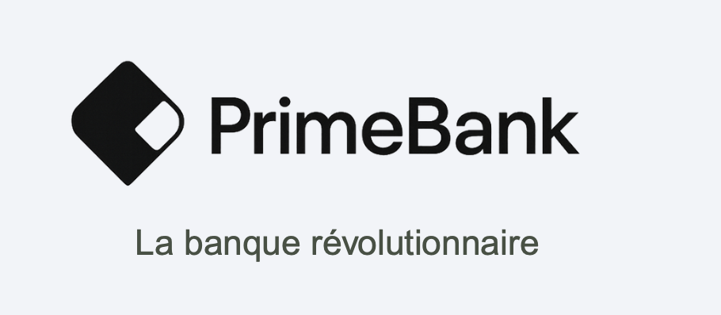

# 🏦 PrimeBank Frontend

Frontend officiel de **PrimeBank**, construit avec **React + TypeScript**, orienté **qualité, scalabilité et standards entreprise**.

---

## 🚀 Stack technique

### Core

* **React 18**
* **TypeScript (strict)**
* **Vite**

### UI & UX

* **Ant Design (v5)** – Design system professionnel
* **Ant Design Message (toasts)**

### Data & Forms

* **TanStack Query** – Fetching, cache, async state
* **React Hook Form** – Gestion performante des formulaires
* **Zod** – Validation & typage des données

### Qualité & Tooling

* **ESLint (flat config)** – Qualité et limiteurs de code
* **Prettier** – Formatage automatique
* **Husky + lint-staged** – Vérifications avant commit
* **GitHub Actions (CI)** – Qualité continue
* **SonarCloud / SonarQube** – Dette technique & sécurité

---

## 📁 Structure du projet

```txt
src/
├── assets/              # Assets statiques
├── components/          # Composants UI réutilisables
├── hooks/               # Hooks custom (TanStack Query, logique)
├── lib/                 # Configs globales (react-query, etc.)
├── pages/               # Pages / écrans
├── schemas/             # Schémas Zod
├── services/            # Appels API
├── types/               # Types globaux
├── utils/               # Helpers purs
├── App.tsx
└── main.tsx
```

---

## ⚙️ Configuration clé

### 🔒 TypeScript (strict)

* `strict: true`
* `noImplicitAny`
* `strictNullChecks`
* Alias d’imports (`@components`, `@services`, etc.)

👉 Objectif : **zéro bug silencieux**

---

### 🧹 ESLint – limiteurs de code

Principales règles :

* Taille max d’une fonction : **50 lignes**
* Taille max d’un fichier : **300 lignes (warn)**
* Profondeur max : **3**
* Complexité max : **10**
* `any` interdit

👉 Empêche la dette technique dès le départ.

---

### 🔐 Husky & lint-staged

À chaque commit :

* ESLint (`--fix`)
* Prettier (`--write`)
* Commit bloqué si erreur critique

👉 Impossible de commit du code sale.

---

### 🌐 Variables d’environnement (Vite)

📄 `.env` (non versionné)

```env
VITE_API_URL=http://localhost:3000
VITE_APP_ENV=development
```

📄 `.env.example`

```env
VITE_API_URL=
VITE_APP_ENV=
```

⚠️ Toutes les variables frontend doivent commencer par `VITE_`.

---

## 🧠 TanStack Query

Configuration centralisée :

📁 `src/lib/react-query.ts`

* cache
* retry
* staleTime
* refetch contrôlé

Bonnes pratiques :

* 1 query = 1 hook
* logique API dans `services/`
* hooks réutilisables

---

## 🧾 Formulaires (RHF + Zod + AntD)

* **Zod** = validation + types
* **React Hook Form** = performance
* **Ant Design** = UI

👉 Toute la validation passe par **Zod**
👉 Pas de règles AntD dupliquées

---

## 🧪 CI & Qualité continue

### GitHub Actions

À chaque PR ou push sur `main` :

1. Installation des dépendances
2. ESLint
3. Build
4. Analyse SonarCloud

📁 `.github/workflows/ci.yml`

---

### SonarCloud / SonarQube

* Bugs potentiels
* Code smells
* Complexité
* Duplications
* Dette technique

Quality Gate recommandé :

* ❌ Bloquer le merge si rouge

---

## 🛠️ Installation & démarrage

### Prérequis

* Node.js ≥ 18
* npm ≥ 9

---

### Installation

```bash
npm install
```

---

### Lancer en développement

```bash
npm run dev
```

---

### Linter le projet

```bash
npm run lint
```

---

### Build production

```bash
npm run build
```

---

## 🌳 Workflow Git recommandé

### Branches

```txt
main            # stable / production
feature/*       # nouvelles features
fix/*           # correctifs
chore/*         # tooling / config
```

### Commits (Conventional Commits)

```txt
feat: add login form
fix: prevent double submit
chore(ci): setup SonarCloud
```

---

## 🔐 Bonnes pratiques de sécurité

* ❌ Aucun secret côté frontend
* ❌ Pas de token privé dans `.env`
* ✅ Validation Zod côté client
* ✅ Gestion erreurs centralisée (à venir)

---

## 📌 État actuel du projet

* ✅ Setup pro initialisé
* ✅ Qualité automatisée
* ✅ CI + SonarCloud
* ✅ Ant Design fonctionnel
* ✅ TanStack Query fonctionnel
* ✅ Base prête pour auth / API / scaling

---

## 🚧 Prochaines évolutions possibles

* Auth (login / refresh token)
* Layout Ant Design (Sidebar / Header)
* Tests (Vitest + Testing Library)
* Gestion des rôles
* Monitoring frontend

---

## 👥 Contribution

1. Créer une branche `feature/*`
2. Commit propre (lint obligatoire)
3. Ouvrir une Pull Request
4. CI + Sonar doivent être verts

---

## 📄 Licence

Projet privé – PrimeBank ©

---

### ✅ Conclusion

Ce projet frontend est configuré selon des **standards entreprise modernes**, avec une emphase forte sur :

> **qualité du code, maintenabilité et sécurité**

---

Si tu veux, je peux aussi :

* t’aider à écrire un **CONTRIBUTING.md**
* préparer un **README plus orienté onboarding**
* ou documenter l’architecture frontend en détail

Installer Yup
*npm install yup
*npm install -D @types/yup
